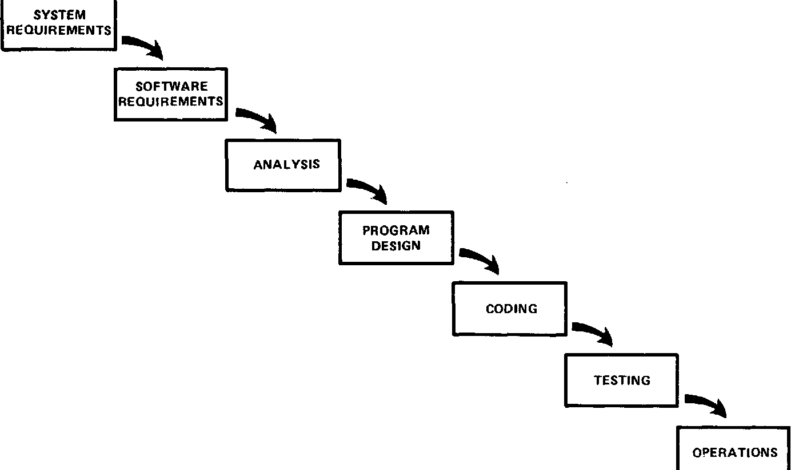
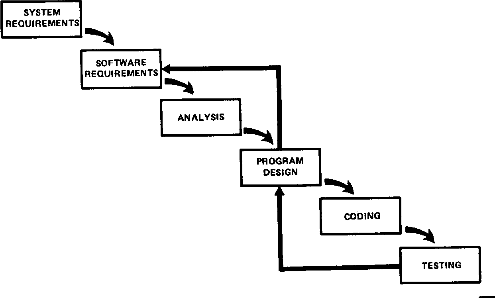
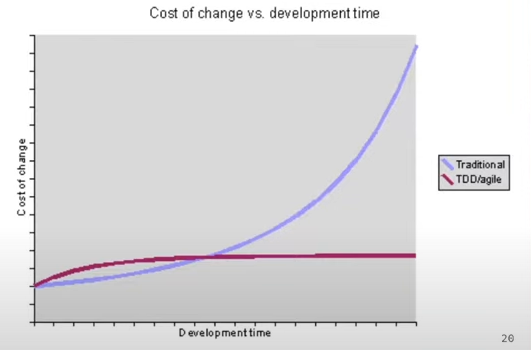
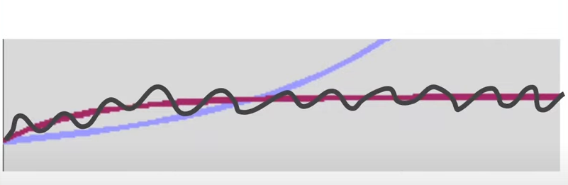

# 你就是不寫測試才會沒時間

https://youtu.be/wTpsxjP0t7M \
講者：Kuma \
主持人：保哥

## 25:00開發思維 
TypeA: 幫客戶把Solution寫成程式 \
TypeB: 還是想一個Solution幫客戶解決問題 

設計是決定Form跟Context的邊界，這樣解決問題才會更精準

## 30:00 何時做設計？
瀑布開發模式 \
來自1970年Winston W. Royce論文，論文即提出此模式不可行 \
大部分的情況，都會變成到QA階段，才知道需求錯了，必須回頭撰寫邏輯

敏捷開發不是為了對抗瀑布式開發，而是為了解決瀑布開發模型的問題

## 34:00 到底開發上會發生什麼事？

若實踐瀑布式開發，最終會產生隨時間增加，而開發成本到後期劇增的問題 \
但若是邊寫邊測試，邊寫邊交付，則開發成本是可控的成長，不會驟然提升

遽增主因：
程式複雜度提升，導致程式開發難度增加

解決辦法：
撰寫程式/重構/測試，三者一體的循環 \
當程式複雜度提升時，藉由既有的測試程式，安心進行重構 \
重構後的程式複雜度下降，則可恢復繼續開發

開發難度降低原因

## 46:00 先寫程式還是先寫測試？
Kuma建議先寫測試，專注於行為而非實作 \
可以少打很多code？Why?

## 52:30 多久開始重構一次？

## 54:00 那找QA測到底有什麼問題？
結論：把測試丟給ＱＡ，是捨本逐末的行為

## 1:10:00 Q&A